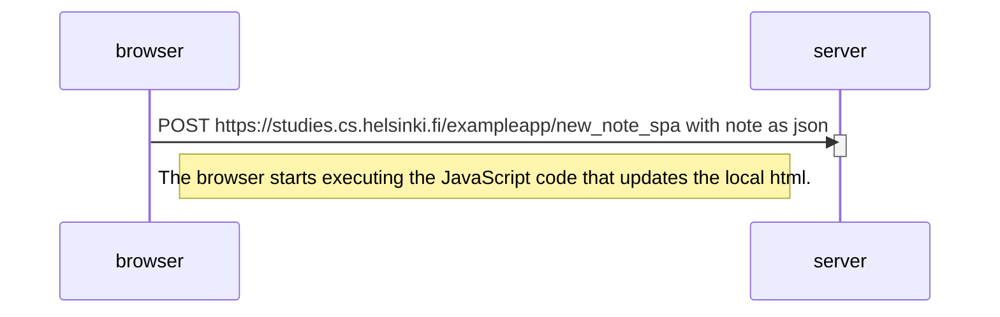

# diagram for https://studies.cs.helsinki.fi/exampleapp/spa

# submitting a note

```mermaid
sequenceDiagram

 participant browser
    participant server
    participant browser

    browser->>server: POST https://studies.cs.helsinki.fi/exampleapp/new_note_spa with note as json
    activate server
    deactivate server

    Note right of browser: The browser starts executing the JavaScript code that updates the local html.
```